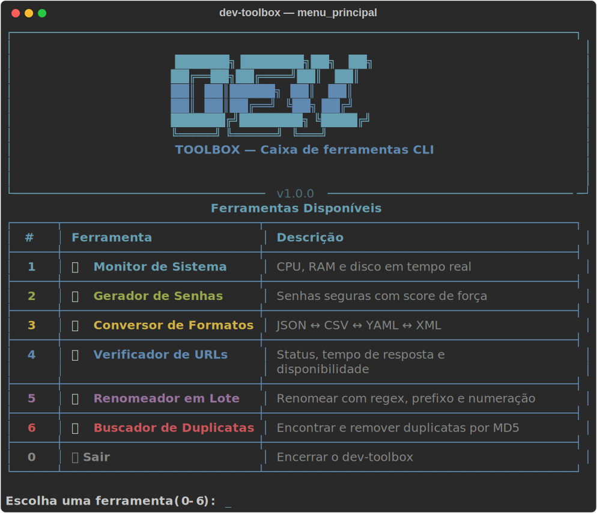
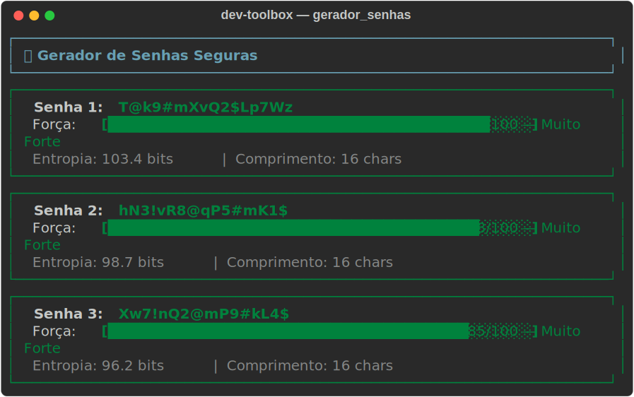
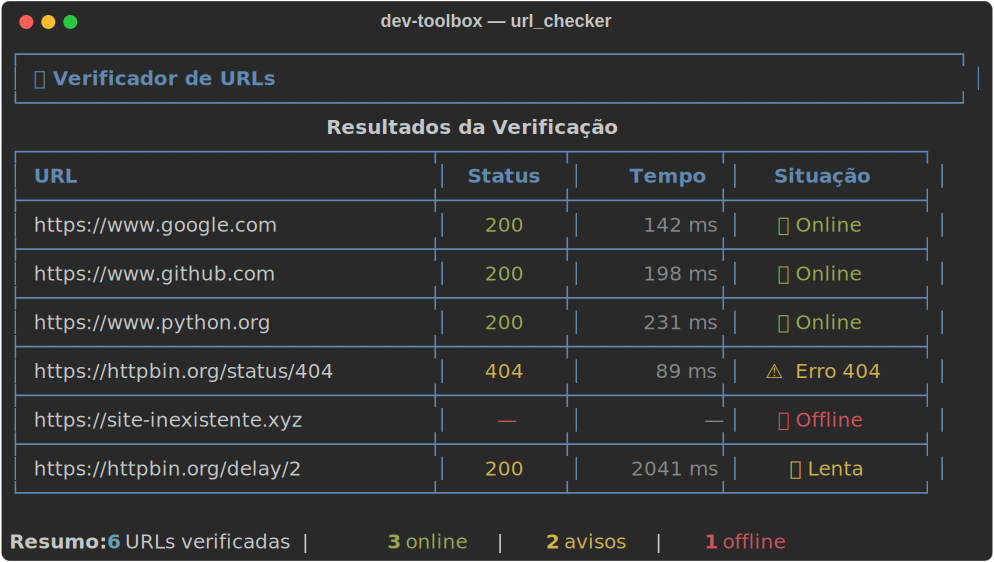
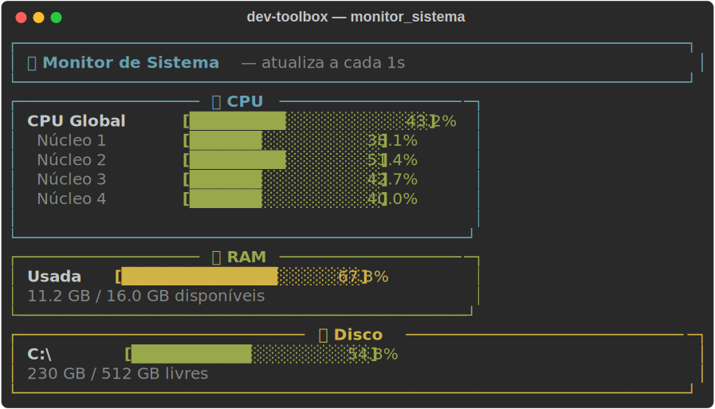
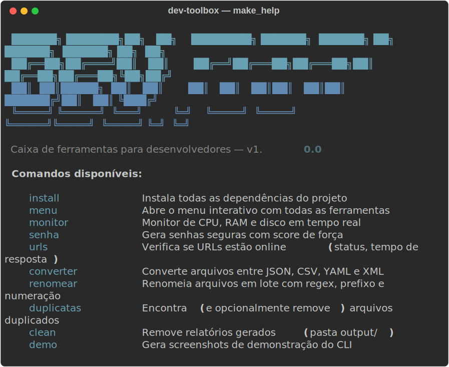

# 🛠️ dev-toolbox

**Caixa de ferramentas para desenvolvedores e analistas** — CLI com interface rica no terminal.

[](https://python.org)
[](https://github.com/Textualize/rich)
[](https://typer.tiangolo.com)
[](LICENSE)
[](CONTRIBUTING.md)

---

## 📋 Sumário

- [Visão Geral](#visão-geral)
- [Screenshots](#screenshots)
- [Ferramentas](#ferramentas)
- [Instalação](#instalação)
- [Uso com Makefile](#uso-com-makefile)
- [Uso via CLI direta](#uso-via-cli-direta)
- [Configuração](#configuração)
- [Relatórios HTML](#relatórios-html)
- [Estrutura do Projeto](#estrutura-do-projeto)

---

## Visão Geral

O **dev-toolbox** é uma coleção de utilitários de linha de comando desenvolvida em Python, com interface rica no terminal usando `rich` e `typer`. Todas as ferramentas geram relatórios HTML com tema escuro ao final da execução.

---

## Screenshots

### Menu Principal



### Gerador de Senhas



### Verificador de URLs



### Monitor de Sistema



### Makefile — make help



---

## Ferramentas

### 🖥️ 1. Monitor de Sistema
Monitora CPU, RAM e disco em tempo real com barras de progresso coloridas e atualização automática.

**Recursos:**
- Uso de CPU por núcleo
- RAM e Swap em uso
- Espaço em disco
- Top processos por CPU
- Cores: verde (< 60%), amarelo (< 85%), **vermelho** (≥ 85%)

---

### 🔐 2. Gerador de Senhas
Gera senhas criptograficamente seguras com score de força de 0 a 100.

**Recursos:**
- Comprimento configurável
- Inclusão/exclusão de maiúsculas, minúsculas, números e símbolos
- Exclusão de caracteres ambíguos (0, O, l, 1, |)
- Score de força: Fraca / Média / Forte / Muito Forte
- Cálculo de entropia em bits

---

### 🔄 3. Conversor de Formatos
Converte arquivos entre JSON, CSV, YAML e XML com auto-detecção do formato.

**Formatos suportados:** `json`, `csv`, `yaml` (yml), `xml`

**Recursos:**
- Auto-detecção do formato pela extensão
- Prévia do resultado no terminal
- Preservação de caracteres Unicode

---

### 🌐 4. Verificador de URLs
Verifica a disponibilidade de URLs com código HTTP e tempo de resposta.

**Recursos:**
- Verificação paralela com múltiplas threads
- Código de status HTTP
- Tempo de resposta em milissegundos
- Detecção de redirecionamentos
- Classificação: rápida (< 500ms), aceitável (< 1500ms), lenta

---

### 📝 5. Renomeador em Lote
Renomeia arquivos com suporte a prefixo, sufixo, substituição de texto, regex e numeração sequencial.

**Recursos:**
- Prefixo e sufixo
- Substituição simples de texto
- Padrões regex
- Numeração sequencial com quantidade de dígitos configurável
- Mudança de extensão
- Modo dry-run (simulação) por padrão — aplica só quando confirmado

---

### 🔍 6. Buscador de Duplicatas
Encontra arquivos duplicados por hash MD5 com opção de remoção automática.

**Recursos:**
- Otimização em dois estágios (tamanho → MD5)
- Busca recursiva opcional
- Cálculo de espaço desperdiçado
- Percentual de duplicatas no resumo
- Remoção com confirmação (mantém o primeiro arquivo)

---

## Instalação

### Pré-requisitos
- Python 3.13+
- pip
- `make` — Git Bash (Windows), Terminal (Linux/macOS)

### Passos

```bash
# Clone o repositório
git clone https://github.com/erikgds2/dev-toolbox
cd dev-toolbox

# Crie e ative o ambiente virtual
python -m venv venv
source venv/bin/activate       # Linux/macOS
venv\Scripts\activate          # Windows (Git Bash)

# Instale as dependências
make install
# ou: pip install -r requirements.txt
```

---

## Uso com Makefile

A forma mais simples de usar o dev-toolbox. Cada comando faz perguntas interativas — sem precisar decorar parâmetros.

```bash
make help          # lista todos os comandos disponíveis
make menu          # abre o menu interativo completo
make monitor       # monitor de sistema (pergunta duração e relatório)
make senha         # gerador de senhas (pergunta comprimento, quantidade...)
make urls          # checker de URLs (pergunta arquivo ou URLs manuais)
make converter     # conversor de formatos (pergunta arquivo e formato)
make renomear      # renomeador em lote (mostra preview antes de aplicar)
make duplicatas    # buscador de duplicatas (pergunta pasta e opções)
make clean         # remove relatórios gerados
make demo          # gera screenshots do CLI em docs/screenshots/
```

**Exemplo de sessão interativa com `make senha`:**

```
  🔐 Gerador de Senhas Seguras
  ─────────────────────────────────────────
  📏 Comprimento da senha (Enter = 16): 24
  🔢 Quantas senhas gerar? (Enter = 1): 3
  🚫 Remover símbolos especiais? (s/N): n
  👁  Excluir caracteres ambíguos (0,O,l,1)? (s/N): s
  📊 Gerar relatório HTML? (s/N): s
```

**Exemplo com `make renomear`:**

```
  📝 Renomeador em Lote
  ─────────────────────────────────────────
  📁 Pasta com os arquivos: ./fotos
  ➕ Prefixo para adicionar (Enter = nenhum): 2024_
  ➕ Sufixo para adicionar (Enter = nenhum):
  🔢 Adicionar numeração automática? (s/N): s

  Mostrando preview das alterações...

  ✅ Aplicar as renomeações? (s/N): s
```

---

## Uso via CLI direta

Para quem prefere passar os parâmetros direto:

```bash
# Menu interativo
python -m src.main

# Monitor de sistema
python -m src.main monitor --duracao 30 --relatorio

# Gerador de senhas
python -m src.main senha --comprimento 20 --quantidade 5 --relatorio

# Conversor de formatos
python -m src.main converter dados.json --para yaml

# Verificador de URLs
python -m src.main urls --arquivo examples/urls.txt --relatorio

# Renomeador em lote (preview)
python -m src.main renomear ./fotos --prefixo "2024_" --dry-run

# Buscador de duplicatas
python -m src.main duplicatas ./downloads --recursivo --relatorio

# Versão
python -m src.main versao
```

**Ajuda por ferramenta:**

```bash
python -m src.main --help
python -m src.main monitor --help
python -m src.main senha --help
```

---

## Configuração

O arquivo `config.json` na raiz controla as configurações globais:

```json
{
  "output_dir": "output",
  "language": "pt-BR",
  "theme": "dark",
  "version": "1.0.0",
  "auto_open_report": false,
  "max_threads": 10,
  "request_timeout": 10,
  "hash_algorithm": "md5",
  "monitor_refresh_rate": 1.0,
  "monitor_historico": 60
}
```

| Campo | Descrição | Padrão |
|-------|-----------|--------|
| `output_dir` | Diretório para relatórios HTML | `output` |
| `max_threads` | Threads para verificação de URLs | `10` |
| `request_timeout` | Timeout HTTP em segundos | `10` |
| `hash_algorithm` | Algoritmo de hash para duplicatas | `md5` |
| `monitor_refresh_rate` | Intervalo de atualização do monitor (s) | `1.0` |
| `monitor_historico` | Segundos de histórico no monitor | `60` |

---

## Relatórios HTML

Todas as ferramentas suportam a flag `--relatorio` para gerar um relatório HTML com:

- **Tema escuro** (fundo `#1a1a2e`, acento `#00d4ff`)
- Timestamp de geração e versão da ferramenta
- Resumo estatístico com cartões
- Tabelas de resultados com badges coloridos

Os relatórios são salvos em `output/` com timestamp:
```
output/gerador_senhas_20240115_143022.html
```

---

## Estrutura do Projeto

```
dev-toolbox/
├── src/
│   ├── main.py              # Menu interativo e comandos CLI
│   ├── report.py            # Gerador de relatórios HTML (tema escuro)
│   ├── config.py            # Configuração global
│   └── tools/
│       ├── system_monitor.py
│       ├── password_gen.py
│       ├── format_converter.py
│       ├── url_checker.py
│       ├── batch_renamer.py
│       └── duplicate_finder.py
├── docs/
│   └── screenshots/         # Screenshots SVG do CLI
├── examples/
│   ├── urls.txt             # Lista de URLs de exemplo
│   └── dados.json           # JSON de exemplo para conversão
├── scripts/
│   └── gerar_screenshots.py # Gerador de screenshots
├── Makefile                 # Comandos interativos simplificados
├── pyproject.toml
├── config.json
├── requirements.txt
├── CONTRIBUTING.md
└── .gitignore
```

---

## Dependências

| Pacote | Versão | Uso |
|--------|--------|-----|
| `rich` | ≥13.0.0 | Interface do terminal e geração de SVG |
| `typer` | ≥0.9.0 | CLI e argumentos |
| `psutil` | ≥5.9.0 | Monitor de sistema |
| `pyyaml` | ≥6.0 | Conversão YAML |
| `requests` | ≥2.31.0 | Verificação de URLs |
| `lxml` | ≥4.9.0 | Parsing XML |

---

## Licença

Projeto de uso pessoal e aprendizado. Código livre para adaptação.
